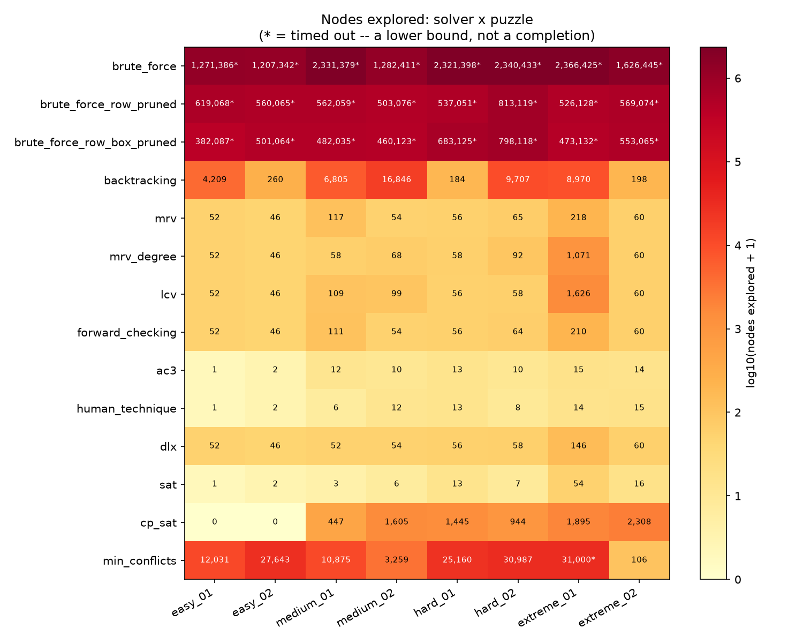
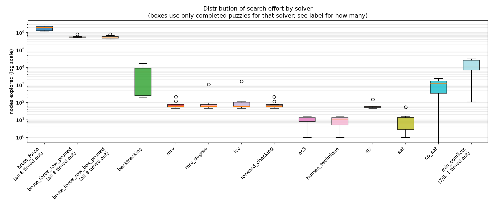
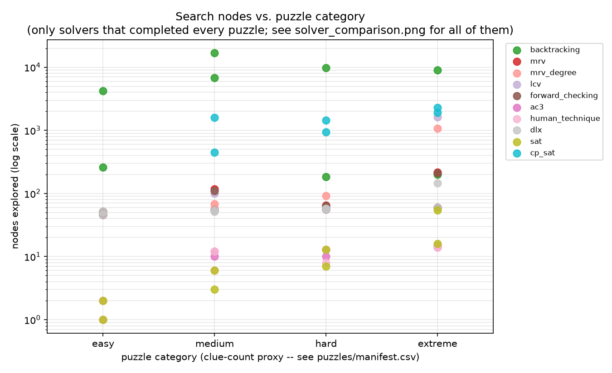
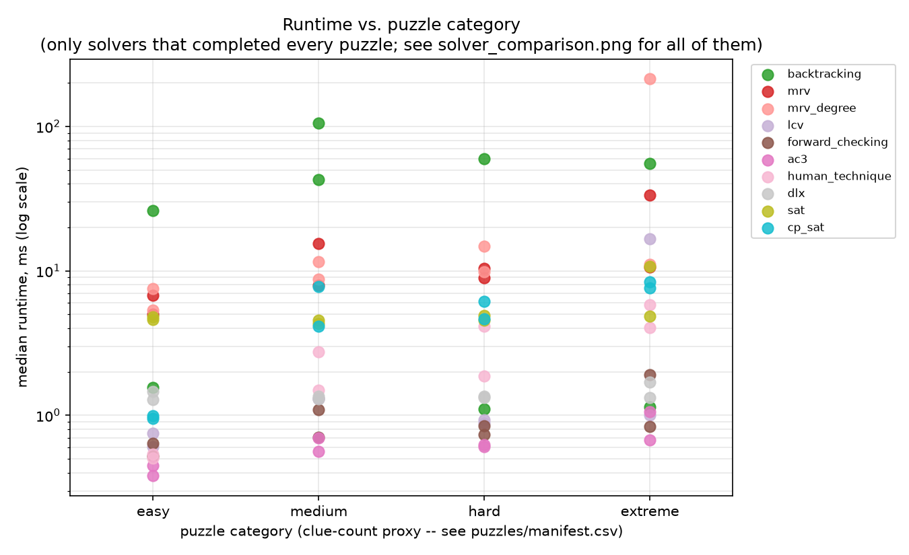

# Sudoku Solver & Algorithm Benchmark

A Sudoku solver framework built to answer one question with actual data
rather than intuition: **how much does search strategy matter, and why?**
Every solving strategy shares one interface, gets benchmarked against the
same puzzles under the same conditions, and gets compared on nodes
explored, constraint checks, and runtime — not just "which one is faster."

This project is as much a small computational experiment as it is a
piece of software: every number in the Results section below came from
actually running the code in this repo (`results/latest.csv`, 14 solvers
x 8 puzzles), not from an estimate or a plausible-sounding guess.

## Why this exists

Sudoku solvers are a well-worn example, which is exactly why they're
useful here: the puzzle itself is trivial to state, so the interesting
part is entirely in *how the search is structured*. This project walks
that structure incrementally — starting from the worst possible strategy
(check nothing until the very end) and adding exactly one idea at a time,
measuring the effect of each one before adding the next, rather than
jumping straight to a good solver and asserting it's good.

## Quick start

```bash
pip install -r requirements.txt
python -m pytest                              # 171 tests (162 + 9 skipped without ortools)
python cli.py --solver mrv --puzzle puzzles/hard/hard_01.txt
python benchmark.py                           # regenerates results/latest.csv
python visualize.py                           # regenerates results/plots/*.png
```

`pip install -r requirements-optional.txt` additionally installs
`ortools`, enabling `CPSATSolver` (stage 16) — everything else works
without it.

`cli.py --list-solvers` prints every registered solver name.

## How a puzzle is represented

`sudoku/board.py`'s `Board` wraps a 9x9 nested `list[list[int]]` (`0` =
empty), chosen over a flat 81-element list for a specific reason: this
project's goal is understanding *search behavior*, not squeezing out the
last bit of raw speed, so the representation that reads the same as the
puzzle on paper won. `Board` only answers questions about a single static
grid (`is_valid_placement`, `is_complete`, `is_valid`) — it has no
knowledge of search, timing, or counters. That separation matters: it
means `Board`'s tests aren't entangled with any solver's, and it's the
reason instrumentation could later be centralized in one place (below)
instead of scattered across every solver's use of `Board`.

## The common solver interface

Every solver in `sudoku/solvers/` extends `Solver` (`sudoku/solvers/base.py`),
an abstract base class, not a `Protocol` — deliberately, because the
whole point of comparing solvers is that their metrics have to mean the
same thing. `Solver.solve()` is the only public entrypoint: it rejects an
already-invalid puzzle up front, hands the subclass a private copy of the
board (so a solver can never mutate what the caller passed in — checked
directly in tests), enforces a timeout, and returns a `SolveResult`
(`solved`, the solution `Board` or `None`, and a `SolveMetrics`).

Subclasses implement one method, `_solve()`, and route every counted
event through three base-class methods:

- `_enter_node()` — once per recursive call. Also where the timeout is
  checked (every 1000 calls, not every one — cheap enough not to distort
  timing, frequent enough to actually stop a runaway search).
- `_record_assignment()` — once per candidate value considered for a cell.
- `_record_constraint_check()` — once per single row/column/box legality
  check (one call to `Board.is_valid_placement`-equivalent logic).

Centralizing this was a deliberate choice, not boilerplate for its own
sake: if every solver tallied its own metrics, "a node" or "a constraint
check" could silently mean something different in each one, and the
whole benchmark would be comparing numbers that only look comparable.

## The algorithms: a pruning ladder, not unrelated ideas

The first five solvers share the exact same fixed cell order (first empty cell,
row-major) and value order (ascending 1–9). The only thing that changes,
rung by rung, is **when a placement gets checked for legality**:

| Solver | file | checks... | 
|---|---|---|
| Brute force | `brute_force.py` | only once the entire board is filled |
| Row-pruned brute force | `brute_force_row_pruned.py` | + each row, the instant it fills |
| Row+box-pruned brute force | `brute_force_row_box_pruned.py` | + each 3x3 box, the instant it fills |
| Backtracking | `backtracking.py` | every single placement, immediately |

**Brute force** is the "no pruning" baseline: nothing is checked until a
leaf (a completely filled board), so its cost is ~9^k for k empty cells —
not an inefficiency, that's what zero pruning means. It exists to make
the other rungs' improvement measurable against something, not to be a
usable solver.

**Row-pruned** and **row+box-pruned** add early checkpoints at natural
Sudoku boundaries. One deliberate omission: there's no "column-pruned"
rung. Under row-major traversal, a column's cells are spread one-per-row
across the whole board, so a column only finishes filling right at the
very end regardless of pruning strategy — a column checkpoint would fire
too late to prune anything a leaf check wouldn't already catch.

**Backtracking** is the limit of the same ladder (check every cell,
immediately) — and turns out to be the *simplest* code in the family, not
the most complex: with no "did a row/box just complete?" bookkeeping
needed, and no leaf-time verification needed (every cell was already
validated on the way in, so a complete board is automatically correct),
it's shorter than either pruned brute-force variant.

**MRV** (`mrv.py`) changes a different axis entirely: not *when* to
check, but *which* cell to fill next. Standard backtracking always picks
the first empty cell in a fixed scan; MRV picks whichever empty cell
currently has the fewest legal candidates — the "fail-first" principle.
A cell with zero candidates means the branch is already dead, and finding
it as early as possible avoids wasting work in a doomed subtree; a cell
with exactly one candidate is a forced move, not a real choice, so
resolving it first avoids creating branches that never needed to exist.
This costs something real: computing "which cell is most constrained"
means checking every empty cell's candidates, not just the chosen one —
measured at roughly 242 constraint checks per node here, versus
backtracking's 8.6. Whether that overhead is worth it is an empirical
question this project's benchmark actually answers below, not an
assumption built into the design.

**Forward checking** (`forward_checking.py`) changes a third axis: not
when to check, not which cell to pick, but *how the information used to
pick it gets computed*. MRV re-derives every empty cell's legal values
from scratch, every node, via `is_valid_placement` calls. Forward
checking instead maintains a running domain (remaining legal values) per
cell as search state — when a value is assigned, it's removed directly
from that cell's peers' domains (a set operation), and precisely undone
on backtrack.

The first draft of this solver's docstring predicted it would explore an
*identical* search tree to MRV, since both use the same "fewest
candidates, row-major tiebreak" selection rule. Measuring it against all
8 benchmark puzzles showed that's almost, but not exactly, right — worth
recording precisely rather than quietly correcting it after the fact:
`assignments_tried` came out exactly equal to MRV's on every single
puzzle, but `nodes_explored` was never higher and strictly lower on 3 of
8 (`medium_01`: 111 vs. 117; `hard_02`: 64 vs. 65; `extreme_01`: 210 vs.
218). The reason is a genuine one-node asymmetry: when an assignment
would wipe out a peer's last remaining candidate, forward checking
detects that immediately via propagation, before ever recursing into the
dead cell. MRV can only discover the identical dead end one level deeper,
via its own next-node rescan — which still costs one real node to find
out. Same conclusion, reached one step apart.

This solver also required a genuine new instrumentation decision: its
per-node work isn't `is_valid_placement` calls at all, it's domain-set
removals — a different, cheaper operation that shouldn't be counted in
the same bucket as `constraint_checks`. See the new `candidate_eliminations`
metric below.

**MRV with a degree-heuristic tiebreak** (`mrv_degree.py`) changes one
more thing, deliberately isolated to a single variable again: MRV's
primary rule (fewest legal candidates wins) stays exactly the same; only
the *tiebreak*, for when two cells have equal candidate counts, changes
— from "whichever comes first in row-major order" to "whichever has more
still-unassigned peers" (its *degree*), on the theory that resolving a
more-connected cell first has a bigger ripple effect on everything else.

Measured against plain MRV, the result is genuinely mixed, not a clean
win — worth stating exactly rather than rounding to a verdict:
`medium_01` improves from 117 to 58 nodes, but `extreme_01` (AI Escargot)
gets **worse**, from 218 to 1,071 nodes — an 8x regression on the one
puzzle in the set with an independently documented difficulty rating.
Both directions are locked into the test suite (`test_mrv_degree.py`) so
neither fact gets silently lost later. This is a direct, concrete
instance of a heuristic that sounds reasonable making things worse in
practice on a specific puzzle, not just in the abstract.

Testing this also surfaced a real data-quality issue, not a bug: on
`hard_01`, plain MRV and the degree-tiebreak variant land on two
**different, independently-valid, complete** solutions. `hard_01` is not
uniquely solvable — something the manifest didn't previously say. The
root cause: `scripts/generate_sample_puzzles.py` only ever verified that
its generated puzzles were *solvable*, never that they were *uniquely*
solvable, and the manifest's uniqueness caveat had only been applied to
the two lowest-clue-count puzzles on the unverified assumption that
higher clue counts were probably safe. That assumption was wrong. The
manifest now flags all 6 self-constructed puzzles equally, and the
generation script's docstring documents the correction rather than
silently fixing it. None of this affects any node-count or runtime
number already reported — those measure search effort, not which
solution gets found.

**Least Constraining Value** (`lcv.py`) is the first change to *value*
order rather than cell order — MRV's natural complement: MRV picks the
most-constrained cell to fail fast, LCV picks the least-constraining
*value* for it, scoring each candidate by how many still-unassigned
peers currently have that value as an option and trying the
least-disruptive one first. Built on top of `ForwardCheckingSolver`
rather than `MRVSolver`, for a concrete reason: scoring a value's
constrainingness means asking "how many peer domains still contain it,"
and forward checking already maintains those domains as live state — MRV
recomputes everything from scratch and keeps nothing to ask that
question of.

Same honest result as the degree heuristic: genuinely mixed, not a win.
`hard_02` improves (64 → 58 nodes vs. plain forward checking), but
`extreme_01` — **the same puzzle the degree heuristic also regressed
on** — gets dramatically worse (210 → 1,626 nodes, ~7.7x). Two unrelated
heuristics both blowing up on the same specific puzzle is now a pattern
worth noting rather than a coincidence to ignore: AI Escargot earned its
"world's hardest" reputation in an era of hand-tuned solvers, and it's
plausible it's specifically adversarial to the kind of local, greedy
scoring both of these heuristics do — a hypothesis, not yet a conclusion,
that the eventual full benchmark should help clarify further.

This also confirms a structural prediction made before measuring:
LCV has no reason to help *prove a puzzle unsolvable*, since ruling out
every value for every cell somewhere is required regardless of the order
they're tried in — reordering values only matters when there's an actual
solution to find faster. Consistent with that, on the hand-built
unsolvable test puzzle, LCV's ordering logic runs zero domain lookups: the
dead cell has zero candidates, so there's nothing to score between.

**AC-3 (full arc consistency, maintained throughout search)** (`ac3.py`)
is a bigger step: not a new cell- or value-ordering rule, but *more
thorough propagation*. Forward checking propagates one hop — from the
cell just assigned to its direct peers — and stops. This solver cascades:
if propagating causes a peer to become a singleton, that singleton is
committed to the board and propagated further in turn, transitively,
until nothing more can be deduced or a wipeout is found. (This is
sometimes called MAC — Maintaining Arc Consistency — to distinguish
running it after every assignment from running AC-3 once as a
preprocessing pass.) The general AC-3 revise rule collapses to something
simpler for Sudoku's specific "not equal to my peer" constraints: a value
only needs removing from a domain when a peer's domain has narrowed to
exactly that value — precisely the technique Sudoku players call a
"naked single." This solver implements that specialized fixed point, not
the fully generic arc-queue algorithm with an abstract constraint
predicate, since the two reach an identical result here.

The results are dramatic and genuinely measured, not designed in:
**`easy_01` and `easy_02` are solved entirely by propagation, with zero
branching** (`nodes_explored == 1` and `2`, respectively — the search
loop never actually has to guess anything). Across all 8 puzzles, this
solver never needs more nodes than forward checking, and often needs
dramatically fewer (`extreme_01`: 210 → 15).

**A real bug worth describing, not glossing over**: an earlier version of
this solver produced a *fully filled, wrong* board on 3 of the 8 puzzles
— `solved=True` with a duplicate value sitting in a row. The cause was a
genuine race in worklist-based propagation: when a cell is forced to a
singleton, it's written to the board immediately, but its *own* effect on
its peers isn't applied until it's later popped from the propagation
queue. In that gap, an unrelated elimination chain can independently
narrow a *different* peer down to the same value and commit it too —
since a peer that's already been written is skipped by everyone else's
propagation, neither one ever gets cross-checked against the other. The
fix: verify a forced value against the actual board before committing it,
rather than trusting that the domain size reaching 1 was sufficient on
its own. Caught by adding an explicit `board.is_valid()` invariant check
at every assignment during development, and now locked in as a
regression test across all 8 puzzles.

**Human-technique elimination** (`human_technique.py`) is the most
directly useful stage for this project's own goals: every prior
propagation-based solver only ever reasons about a single cell's own
domain size, which structurally misses two things a human solver
routinely uses. A **hidden single** is a candidate that can legally go in
only one cell of some row/column/box, even though that cell still has
*other* candidates too — it never shows up as an obviously-size-1
domain, so finding one means looking at an entire unit at once ("which
cells in this row could still be a 7"), which needed a new `Board.UNITS`
structure (`peers()` alone, being per-cell, can't answer that). A
**naked pair** is two cells in a unit sharing an identical 2-value
domain — between just those two cells, both values are fully "used up,"
so they can be eliminated from every other cell in that unit even though
neither pair cell is itself resolved. Deliberately not built: hidden
pairs, pointing pairs, and anything past that (X-Wing, Swordfish, ...) —
enough scope to go meaningfully beyond AC-3 without building a full
technique library. Architecture-wise this is `ac3.py`'s fixed-point loop
with these two techniques layered in, tried cheapest-first, looping back
to naked singles whenever a stronger technique changes anything (since it
might have just created one), falling back to MRV search only once a
full pass finds no technique makes any progress at all.

This directly enables the thing stage 7 flagged as a real limitation: a
puzzle's difficulty tier is now measurable from what it actually
required, not guessed from clue count. Across the 8 benchmark puzzles:

| puzzle | hidden singles used | naked pairs used | nodes needed |
|---|---|---|---|
| easy_01 | 0 | 0 | 1 |
| easy_02 | 2 | 0 | 2 |
| medium_01 | 11 | 0 | 6 |
| medium_02 | 11 | 3 | 12 |
| hard_01 | 7 | 9 | 13 |
| hard_02 | 10 | 0 | 8 |
| extreme_01 | 28 | 8 | 14 |
| extreme_02 | 10 | 6 | 15 |

Worth stating plainly rather than overselling this solver's power: only
`easy_01` is solved with zero guessing (`nodes == 1`) — every other
puzzle in the set needs at least some backtracking even with all three
techniques combined. Three techniques is enough to demonstrate a
technique-based difficulty signal, not enough to make guessing
unnecessary on anything but the easiest puzzle here.

Another honest, measured result, not an assumption: **more powerful
propagation doesn't always mean fewer search nodes.** Compared to
`AC3Solver`, this solver needs fewer nodes on `medium_01` (12 → 6) but
*more* on `medium_02` (10 → 12) and `extreme_02` (14 → 15). The reason is
the same one the degree heuristic and LCV already surfaced (stages
10–11): a different elimination order changes which cell the shared MRV
rule sees as "most constrained" at each branch point, and that greedy
choice isn't guaranteed to be globally better just because more was
deduced first.

**Dancing Links / Algorithm X** (`dlx.py`) is the first solver in this
project that isn't Sudoku-specific backtracking dressed up differently —
it's a general exact-cover solver applied to a Sudoku-shaped matrix.
Every (row, col, value) placement must satisfy exactly 4 constraints
(this cell is filled; this row has this value once; this column has this
value once; this box has this value once), giving a 729-row by
324-column binary matrix. Solving the puzzle means finding a set of rows
that covers every column exactly once. Algorithm X does this by
repeatedly picking the *least-populated* remaining column (its own
built-in MRV — Knuth's paper calls it the S heuristic), trying each row
that satisfies it, and recursively removing everything that choice
conflicts with. "Dancing Links" is the specific trick that makes that
removal — and, critically, its exact undo on backtrack — O(1): a
circular doubly-linked node splices out with two pointer writes and
splices back in exactly where it was with two more, no array copying.

Before writing this, I'd flagged a real question: would `nodes_explored`
and the other metrics even transfer to a completely different paradigm?
The answer turned out to be **partially, and cleanly split**:
`nodes_explored` and `assignments_tried` transfer with no adjustment at
all, because Algorithm X's recursion has the *exact same shape* as every
other solver here — pick the most-constrained thing, try each option,
recurse, backtrack. What doesn't transfer, and isn't forced to:
`constraint_checks` and every propagation-specific counter legitimately
read **0** for this solver, always — there is no `is_valid_placement`-
equivalent call anywhere in it, since the exact-cover encoding makes
legality structural (a row literally cannot be chosen once its column is
gone). That's a real fact about how the algorithm achieves correctness,
not an instrumentation gap. One new counter was still worth adding,
following the same pattern as every prior stage's genuinely new
operation: `columns_covered`, one per column removed during search.

Measured against `MRVSolver` (the closest architectural analog — same
"pick the most constrained thing" shape, different substrate), node
counts match exactly on `easy_01`, `easy_02`, `medium_02`, and
`extreme_02`, and diverge on the rest (`extreme_01`: 218 vs. 146) — the
same kind of tie-break-order sensitivity already seen between
`MRVSolver` and `ForwardCheckingSolver` in stage 9, here arising from
DLX scanning columns in insertion order rather than MRV's row-major cell
order. Correctness was checked two ways: the same `board.is_valid()`
invariant discipline stage 12's bug taught me to apply to any new
propagation-shaped solver, and cross-checking DLX's answer against
`BacktrackingSolver` (built and tested independently, stage 3) on the
two puzzles trusted to have a unique solution.

That cross-check surfaced a second real data-quality finding: **`medium_01`
also has multiple solutions.** DLX and backtracking solve it to two
different, both fully valid, both givens-preserving completions. Only
`easy_01` and `extreme_01` are trusted unique in this puzzle set now —
every self-constructed puzzle carries a "not verified unique" caveat, and
two of them (`hard_01`, stage 10; `medium_01`, this stage) are now
*confirmed*, not just unverified, to actually have more than one.

**SAT / DPLL** (`sat.py`) is a from-scratch DPLL (Davis-Putnam-Logemann-
Loveland) solver over a CNF encoding of the puzzle — not a wrapper around
an external SAT library, for the same reason DLX wasn't built on a
generic exact-cover package: using a black box would mean the actual
solving isn't something built or understood here. The encoding: one
boolean variable per (cell, value) pair (729 total), with clauses
requiring each cell to hold at least one value and at most one, and each
row/column/box to contain each value at least once and at most once. A
genuine design choice worth stating: the "at least one" clauses for
rows/columns/boxes are technically *redundant* — pigeonhole already
forces them given everything else — but including them anyway is a
standard, well-known technique (redundant clauses give unit propagation
more to work with), and the goal is a faithful textbook encoding, not a
minimal one.

The same partial-transfer question came up as with DLX, and resolved
more richly this time: DPLL's unit propagation is structurally almost
identical to `ac3.py`'s naked-single propagation, just over CNF literals
instead of a domain dict. A forced *positive* literal (proves a cell IS
some value) is exactly a cell's value being derived, so it reuses
`propagated_assignments`; a forced *negative* literal (proves a cell is
NOT some value) is exactly one candidate ruled out, so it reuses
`candidate_eliminations`. One thing is genuinely new: a **conflict** —
unit propagation deriving a direct contradiction, forcing an immediate
backtrack — is standard SAT vocabulary with no existing equivalent, so it
gets its own counter. `constraint_checks`, `domain_lookups`,
`hidden_singles_found`, `naked_pairs_found`, and `columns_covered` all
stay at 0, since none of those operations exist in a CNF solver. Worth
naming directly: every other solver in this project makes one 9-ary
decision per branch point ("assign this cell one of 9 values"); DPLL only
ever makes *binary* decisions, so a 9-ary Sudoku choice becomes up to 9
binary ones, most of which unit propagation is expected to collapse
before they're ever reached as a real decision.

**A second real bug, and a specific class of mistake worth naming**:
detecting a conflict partway through updating a variable's affected
clauses, then returning immediately — leaving clauses *later* in that
same list never updated for this assignment — while `_undo` on backtrack
unconditionally reverses the *entire* list regardless of how much of it
was actually touched. The result was counters silently drifting off by
one in either direction, surfacing later as a crash (`unit clause has no
unassigned literal`) rather than a wrong-but-valid board. Found the same
way as stage 12's bug: tracking one specific clause's counters against a
fresh recount from the actual assignment state and watching them
diverge. The fix is a general lesson, not specific to SAT: when an
event's bookkeeping touches a whole collection and that bookkeeping will
later be reversed as a unit, either finish updating the whole collection
before reacting to what you found, or make the undo precise about
exactly what was touched — never both "partial forward update" and
"total reversal."

**General-purpose CP (Google OR-Tools CP-SAT)** (`cp_sat.py`) is a
deliberately different *kind* of entry, not another algorithm built from
scratch: the question it answers is "how does everything built by hand
in this project compare to just handing the puzzle to a mature,
professional solver." This needed a real decision before writing any
code: `ortools` is a large package (~20MB+, a compiled C++ core), which
conflicts with the "minimal dependencies" principle every other stage
followed. Resolved by making it an **optional** dependency
(`requirements-optional.txt`) — the import is guarded, and
`sudoku/solvers/__init__.py` only registers this solver in `ALL_SOLVERS`
when it actually succeeds, so `cli.py --list-solvers` and `benchmark.py`
simply don't mention it rather than crashing when it's absent. Verified
directly, not assumed: with `ortools` uninstalled, the solver count drops
from 13 to 12, `cp_sat` disappears from `--list-solvers`, and this
solver's 9 tests skip cleanly instead of failing.

The model itself is almost the whole file, which is the point: 81
integer variables with domain `[1, 9]` *directly* — contrast this with
`sat.py`'s 729-boolean encoding, which needed explicit "at least one
value" clauses precisely because plain CNF has no notion of a
multi-valued domain; a CP solver's native finite-domain variables make
that constraint free — plus one `AllDifferent` constraint per row,
column, and box, plus a fixed value per given. No search code, no
propagation code: CP-SAT supplies all of that internally, as a black box
by design. One real, deliberate tradeoff: CP-SAT defaults to
multi-threaded parallel search, which would be neither reproducible nor
comparable to this project's single-threaded solvers in any node-count
sense — this solver forces single-threaded, seeded search instead,
verified deterministic across repeated runs, giving up some of CP-SAT's
real-world performance advantage for a fair comparison.

Metrics here are read once from CP-SAT's own reported statistics after
`Solve()` returns, not built up via `_enter_node()`/`_record_*` calls
like every other solver, since there's no search loop of this project's
own to instrument: `nodes_explored` from `NumBranches()`, `conflicts`
from `NumConflicts()` (reusing `sat.py`'s counter — CP-SAT's search core
is itself SAT-based, so "conflict" means the same thing). Everything else
stays at 0, including `assignments_tried`: CP-SAT doesn't expose a
comparable per-node "candidates tried" figure, and every other counter
here names an operation that simply isn't visible from outside this
solver.

The results are striking and worth being honest about rather than
downplaying: **`easy_01` and `easy_02` solve with `nodes_explored == 0`**
— resolved entirely by CP-SAT's presolve, no search at all — and every
puzzle in the set solves in under 7ms, including `extreme_01` (AI
Escargot), which several of this project's own heuristics struggled with
comparatively. That's not a criticism of anything built here — it's the
expected, honest outcome of comparing hand-rolled solvers built one
concept at a time against a tool with years of engineering behind it.

**Local search / min-conflicts** (`min_conflicts.py`) is the largest
character shift in the whole project. Every other solver constructs a
partial assignment and backtracks on failure. This one starts from a
*complete* assignment (every cell filled, likely with violations) and
repeatedly repairs the worst-conflicting cell — no recursion, no undo, no
search tree. That breaks assumptions the rest of the project leans on,
worth stating precisely rather than softening: this algorithm is
**incomplete** (it can fail to find a solution that exists, stuck in a
local optimum) and it can **never prove a puzzle unsolvable** — a
failure to converge means "didn't find one," not "none exists." Because
of that, this solver reports *every* failure to converge as
`timed_out = True`, whether the wall-clock limit or its internal
iteration/restart budget actually stopped it — deliberately never the
bare "no solution" claim every other solver here can correctly make.

Initialization fills each row with a random permutation of its missing
digits — deliberately not the naive fully-random fill — making every row
conflict-free *by construction* and leaving only column/box conflicts to
repair, roughly halving the constraint surface from the start. Moves are
row-local swaps between two non-given cells (not free reassignment,
which would break that row invariant), picking whichever swap partner in
the row most reduces total conflicts, ties broken randomly. Randomness
is seeded (default 0) for the same reproducibility every other solver
gets from being deterministic — verified directly, not assumed, by
re-solving the same puzzle 3 times and checking identical results.

A real bug, caught before it could look like an unsolvable puzzle: a row
with fewer than 2 non-given cells has no swap partner at all, and
`rng.choice` on the resulting empty candidate list raised `IndexError`
rather than being treated as a legitimate no-op. Exactly the shape of
this project's own hand-built unsolvable test puzzle (each blank is the
only blank in its row) — fixed by treating "no partner available" as a
real, valid outcome: leave that cell alone this iteration.

Measured, not tuned to look good: this solver solves `easy_01`,
`easy_02`, `medium_01`, `medium_02`, `hard_01`, `hard_02`, and
`extreme_02` — but **fails to converge on `extreme_01` (AI Escargot)**,
even given a generous budget (90,000 iterations, 17 restarts, 15
seconds). That's a genuine result, not a bug to quietly fix by cranking
up the iteration budget until it happens to succeed — every
complete-search solver in this project solves this puzzle; this one
doesn't, within this budget. It's also consistent with a pattern that
first showed up in stage 10: AI Escargot is exactly where the degree
heuristic and LCV both regressed sharply too. Three unrelated greedy,
local heuristics now all struggle specifically on this one puzzle, which
is a stronger version of the same hypothesis noted back then — worth
investigating further once the full benchmark is in, not concluding from
this alone.

New instrumentation: `nodes_explored` is repurposed as an iteration
count (reusing `_enter_node()` gets the existing timeout-polling
mechanism for free), and a new counter, `restarts`, was added below —
the one genuinely new event this paradigm introduces, since nothing else
in this project ever discards its own progress and starts over.

## Metrics: what's measured, and what isn't comparable

- **nodes_explored** — one per recursive call. Comparable across all five
  solvers; they share the same recursive skeleton.
- **assignments_tried** — one per candidate value considered for a cell
  (whether or not it's later accepted). Comparable for the same reason.
- **constraint_checks** — one per single-cell legality check. This
  required a deliberate choice to stay comparable: every solver, at every
  checkpoint (leaf, row, box, or single cell), counts checks in the same
  atomic unit — one `is_valid_placement`-equivalent call — rather than
  each solver defining its own notion of "a check." That choice turned
  out to matter: see Interpretation below, where total constraint checks
  (not node count) is what actually predicts which solver runs faster.
- **runtime_seconds** — wall clock (`time.perf_counter()`), unavoidably
  noisy (system load, scheduling, thermal throttling). Reported as the
  median of 5 repeated runs, which resists an occasional slow outlier
  better than a mean would. A run that timed out is *not* repeated —
  with a fixed timeout on a fixed puzzle, it hits the same wall every
  time, so repeating it measures nothing new.
- **candidate_eliminations** — added for forward checking (stage 9): one
  per value actually removed from a peer's candidate set during search.
  This is *not* the same unit as `constraint_checks` (a single-value set
  removal vs. a full row/column/box legality scan) and comparing their
  raw magnitudes as if they measured the same thing would be misleading.
  It's 0 for every solver that doesn't do propagation.
- **domain_lookups** — added for LCV (stage 11): one per peer-domain
  membership check performed while scoring a candidate value's
  constrainingness, before any assignment. A cheaper operation still than
  either of the above (a membership test against an already-known set,
  no legality logic and no mutation). 0 for every solver that doesn't
  reorder values.
- **propagated_assignments** — added for AC-3 (stage 12): one per cell
  whose value was *derived* by propagation reaching a fixed point, rather
  than chosen and tried by the search loop. These were never a branching
  decision, so counting them as `assignments_tried` would misrepresent
  what happened. 0 for solvers that don't propagate to a fixed point.
- **hidden_singles_found** / **naked_pairs_found** — added for
  human-technique elimination (stage 13): one per *application* of that
  named technique, distinct from `propagated_assignments` (which counts
  cells resolved, regardless of which technique resolved them). This is
  the basis for a difficulty signal grounded in which techniques a
  puzzle actually required, rather than a clue-count proxy. 0 for every
  solver that doesn't implement the technique.
- **columns_covered** — added for Dancing Links (stage 14): one per
  exact-cover column removed during search. This solver's
  `constraint_checks` and every propagation-specific counter above
  legitimately stay 0 — there's no `is_valid_placement`-equivalent
  operation anywhere in it, since legality is enforced structurally by
  the exact-cover encoding rather than checked explicitly.
- **conflicts** — added for SAT/DPLL (stage 15): one per direct
  contradiction unit propagation derives (an empty clause), forcing an
  immediate backtrack. Standard SAT-solving vocabulary with no existing
  equivalent among the counters above — a forced positive literal reuses
  `propagated_assignments` and a forced negative literal reuses
  `candidate_eliminations`, since those are the same underlying concepts,
  but a conflict genuinely isn't. 0 for every non-CNF solver.
- **restarts** — added for local search / min-conflicts (stage 17): one
  per discard-and-refill after getting stuck. The one genuinely new
  event that paradigm introduces — nothing else in this project ever
  throws away its own progress and starts over. 0 for every
  complete-search solver.
- **Memory** was considered and deliberately not measured: these
  algorithms' search depth is bounded by 81 and each node's state is a
  small board copy, so there's little reason to expect memory to
  differentiate them the way node count and check count do.

## The puzzle set and how difficulty is defined

8 puzzles, 2 per category (easy/medium/hard/extreme), listed with full
sourcing in [`puzzles/manifest.csv`](puzzles/manifest.csv). One puzzle —
`extreme_01`, "AI Escargot" by Arto Inkala (2006) — has an independently
documented difficulty rating (11.0 on the Sudoku Explainer scale). The
other 7 are self-constructed (`scripts/generate_sample_puzzles.py`) by
removing a target number of cells from a valid solved grid (a fixed seed,
for reproducibility), with their category assigned purely by **clue
count** — a proxy, not a validated difficulty rating. All 6 self-built
puzzles carry a "not verified unique" caveat in the manifest, since the
generation script only ever checked solvability, never uniqueness; two
of them (`medium_01`, `hard_01`) have since been *confirmed*, not just
flagged as unverified, to actually have multiple solutions, found by
cross-checking different solvers' answers (stages 10 and 14). None of
this affects anything measured here — every metric is about the search
process, not which solution it finds.

Whether clue count actually predicts computational effort is exactly the
kind of question this project is set up to check empirically, not assume
— see Interpretation below, because the answer turned out to be "no."

**Update (stage 13):** `HumanTechniqueSolver`'s `hidden_singles_found`
and `naked_pairs_found` counts now give a real, technique-grounded
difficulty signal instead of relying purely on clue count — see that
solver's writeup above for the actual per-puzzle numbers. This project's
category labels still come from clue count for now; replacing them with
a technique-tier classification is a natural next step but a separate
decision from adding the solver that makes it possible, not made here.

## Running the benchmark

`benchmark.py` loads every puzzle from the manifest and runs every
registered solver against it under identical conditions (5s timeout, 5
repeated runs for timing where applicable), writing one row per (solver,
puzzle) pair to `results/latest.csv` (plus a timestamped copy for run
history, not committed). The schema is derived from `SolveMetrics`'
fields directly rather than a hand-maintained column list, since a fixed
list already fell behind once (stage 12) as new solver-specific counters
kept getting added. `visualize.py` reads that CSV — nothing is plotted
from a number embedded directly in plotting code — and writes four PNGs
to `results/plots/`.

## Results

The full run: **14 solvers x 8 puzzles** (13 built in this project plus
the optional `cp_sat`, since `ortools` happened to be installed for this
run — see stage 16 for what happens when it isn't).

**All 3 brute-force variants time out on every single puzzle**, exactly
as stage 2's complexity argument predicted — now confirmed across the
complete set rather than a handful of examples. **`min_conflicts` times
out on exactly one puzzle, `extreme_01`** (AI Escargot) — the one place
in this entire benchmark where completeness actually mattered: every
other solver that attempted `extreme_01` found a solution; only the one
algorithm that can never prove anything failed to. The other 10 solvers
complete all 8 puzzles.



Fewest-nodes winner per puzzle, among the 10 solvers that complete
everywhere:

| puzzle | category | winner | nodes |
|---|---|---|---|
| easy_01 | easy | cp_sat | 0 |
| easy_02 | easy | cp_sat | 0 |
| medium_01 | medium | sat | 3 |
| medium_02 | medium | sat | 6 |
| hard_01 | hard | ac3 | 13 |
| hard_02 | hard | sat | 7 |
| extreme_01 | extreme | human_technique | 14 |
| extreme_02 | extreme | ac3 | 14 |

Ranked by **total nodes summed across all 8 puzzles** (fewest to most):
`human_technique` (71) < `ac3` (77) < `sat` (102) < `dlx` (524) <
`forward_checking` (653) < `mrv` (668) < `mrv_degree` (1,505) < `lcv`
(2,106) < `cp_sat` (8,644) < `backtracking` (47,179).

Ranked by **median runtime** instead: `ac3` (0.62ms) < `forward_checking`
(0.84ms) < `lcv` (1.00ms) < `dlx` (1.36ms) < `human_technique` (2.74ms) <
`sat` (4.78ms) < `cp_sat` (6.11ms) < `mrv` (10.36ms) < `mrv_degree`
(11.09ms) < `backtracking` (42.73ms).

**These two rankings disagree, and that disagreement is itself the
result.** The solvers needing the fewest nodes (`human_technique`, `ac3`,
`sat`) are not the fastest in wall-clock time; `ac3`, `forward_checking`,
`lcv`, and `dlx` are — despite `dlx` and `lcv` frequently needing more
nodes than `human_technique` or `sat`. See Interpretation below for why.







## Interpretation

*(Clearly separated from the measurements above: this section is reading
meaning into the numbers, not reporting new ones.)*

**Fewer nodes doesn't mean faster, and this run confirms it's not a
quirk of any one pair of solvers.** Stage 7 found this comparing just
MRV and backtracking (MRV needed far fewer nodes but lost on wall time
3-of-8 times, because its per-node cost was ~28x backtracking's). With
all 10 completing solvers in the picture, the same shape holds at a
larger scale: `human_technique` and `sat` need the *fewest total nodes*
of anything in the set, but `ac3` and `forward_checking` are *faster in
wall time* — because scanning every empty cell for a hidden single, or
running full DPLL machinery, costs more per node than a plain domain-size
comparison does. Fewer, more expensive nodes can lose to more, cheaper
ones. Total-operation-count reasoning (stage 7's "count total constraint
checks, not nodes, to predict the runtime winner") doesn't generalize
across this full set the way it did for MRV vs. backtracking, though:
`dlx`'s `columns_covered`, `sat`'s `conflicts`, and `ac3`'s
`candidate_eliminations` are different currencies measuring different
operations, by design (see Metrics above) — there is no single
"total work" number that's honest to compute across all of them.

**Does clue count predict computational effort? It depends which solver
you ask.** Correlating each solver's own node counts against puzzle
category (easy=0 .. extreme=3) gives a genuinely different answer per
solver: essentially zero for `backtracking` (r=0.003 — stage 7's original
finding, confirmed again), weak-to-moderate for the ordering heuristics
(`mrv` r=0.50, `lcv` r=0.51, `forward_checking` r=0.51), and moderate for
the strongest propagation-based solvers (`ac3` r=0.89, `human_technique`
r=0.89, `cp_sat` r=0.89). Clue count isn't a *meaningless* difficulty
signal — it's a signal whose reliability depends on how much deduction
the solver reading it does before it would need to guess. That's a more
precise claim than stage 7's "no" made possible with only two solvers to
compare.

**AI Escargot specifically defeats greedy, local heuristics — now
confirmed a third and fourth way.** The degree-heuristic tiebreak (stage
10) and LCV (stage 11) both regressed sharply on `extreme_01` specifically.
This run adds two more data points to the same pattern: `min_conflicts`
is the *only* solver in the entire benchmark that fails to converge
anywhere, and it fails specifically on `extreme_01`; `mrv_degree` needs
1,071 nodes there against `mrv`'s 218, and `lcv` needs 1,626 against
`forward_checking`'s 210 — both by far their worst relative showing in
the set. Four independent greedy/local mechanisms, all struggling on the
same specific puzzle, is a real pattern worth a dedicated investigation,
not a coincidence to wave away.

**A genuinely counterintuitive result: hand-rolled specialized code beats
an industrial solver here, in wall-clock time.** `cp_sat` needs very few
or zero nodes (presolve alone settles both easy puzzles) and is fast in
absolute terms (under 10ms everywhere) — but it's *slower* than `ac3`,
`forward_checking`, `lcv`, and `dlx`, all of which are simple, specialized
solvers built in this project. The likely reason: OR-Tools pays real
fixed overhead building and transferring a model through its Python
bindings into its C++ core, a cost this project's own tiny, Sudoku-only
solvers never pay. That's not evidence CP-SAT is a weak tool — it's
evidence that for a problem this small, specialized beats general, and
that conclusion would likely reverse on a harder or larger CSP where
CP-SAT's presolve and learned clauses would matter more than call
overhead.

**Timing noise varies enormously by speed regime, and that changes what
can be trusted.** The coefficient of variation across 5 repeated runs is
under 0.5% for the slower, millisecond-plus solvers (`mrv_degree` 0.21%,
`mrv` 0.33%, `backtracking` 0.45%) but climbs to 15–36% for the fastest
ones (`cp_sat` 15%, `dlx` 29%, `sat` 36%) — at sub-5ms runtimes, OS
scheduling and timer resolution start to dominate the measurement itself.
Practical consequence: the *order* of magnitude differences discussed
above (10x–600x) are robust to this noise, but the exact ranking among
`ac3`, `forward_checking`, `lcv`, and `dlx` (all within about a
millisecond of each other) should be treated as roughly tied, not as a
precise ordering, on this data alone.

## Limitations

- **N = 8 puzzles, 2 per category.** Everything above describes this
  specific set, not a statistically powered claim about Sudoku in
  general — including the per-solver category-correlation numbers, which
  are correlations over 8 points, not a validated statistical claim.
- **Difficulty is a clue-count proxy for 6 of 8 puzzles** — only AI
  Escargot has an independently documented rating, and `human_technique`'s
  technique-tier counts (stage 13) are a real alternative signal that
  this project has not yet switched the manifest over to using.
- **Zero completed brute-force data points exist anywhere in this
  benchmark.** Every brute-force number is a lower bound ("got this far
  in 5s"), never a completion — there is no way, with this data, to say
  how much row/box pruning actually helps brute force *when both
  finish*, because neither ever does.
- **Single machine, single benchmark run.** The wide range in measured
  timing noise (0.2%–36% CV, see Interpretation) is itself evidence that
  "how noisy is this" depends heavily on how fast the solver already is —
  not a single number that generalizes to another machine, another load
  level, or another solver not yet measured.
- **Three puzzles (`easy_02`, `hard_02`, `extreme_02`) aren't verified to
  have a unique solution; two more (`medium_01`, `hard_01`) are now
  *confirmed*, not just unverified, to have multiple** (stages 10 and
  14, found via cross-solver comparison) — irrelevant to every
  effort/runtime finding above, since those measure search process, not
  which solution gets found, but worth knowing if reasoning about "the"
  solution to those specific puzzles.
- **`min_conflicts`'s single measured timeout overshot the nominal 5s
  limit by about 70ms** (`hard_02`, one run: 5067ms). A known, minor
  imprecision of the shared timeout mechanism (checked every 1000 nodes,
  not continuously — see `base.py`), not a bug: a solver whose "nodes"
  are cheap can run for a while past the deadline before the next check
  notices, and if it happens to finish in that window it reports success
  slightly over budget. Immaterial to any conclusion above.
- The "~28x" per-node overhead figure (stage 7, MRV vs. backtracking) is
  an average across a whole search specific to those two solvers; it
  isn't computed, or necessarily meaningful, for every pair in the full
  14-solver set.

## Future work

Every solver originally planned across stages 9–17 is now built and
benchmarked together (14 solvers x 8 puzzles, see Results/Interpretation
above). Still open: extending `human_technique.py` with hidden pairs and
pointing pairs; replacing the puzzle manifest's clue-count categories
with a technique-tier classification now that stage 13 makes one
possible; a dedicated investigation into why `extreme_01` specifically
defeats greedy/local mechanisms (now measured a fourth way, via
`min_conflicts`'s only convergence failure in the whole benchmark); a
larger, independently-rated puzzle dataset; and a completed
(non-timed-out) brute-force comparison on deliberately tiny puzzles,
since none of the 8 in this set are small enough for any brute-force
variant to actually finish.

## Project layout

```
sudoku/
  board.py              Board representation + validation
  solvers/
    base.py             Solver ABC + shared instrumentation
    brute_force.py       ─┐
    brute_force_row_pruned.py       } the pruning ladder
    brute_force_row_box_pruned.py  ─┘
    backtracking.py      the ladder's fully-incremental limit
    mrv.py               cell-selection heuristic on top of backtracking
    forward_checking.py  incremental domains instead of MRV's rescans
    mrv_degree.py        MRV with a degree-heuristic tiebreak
    lcv.py               forward checking + least-constraining-value order
    ac3.py               full arc consistency, maintained throughout search
    human_technique.py   naked/hidden singles + naked pairs, then MRV search
    dlx.py               Dancing Links / Algorithm X (exact cover)
    sat.py               from-scratch DPLL over a CNF encoding
    cp_sat.py            Google OR-Tools CP-SAT (optional dependency)
    min_conflicts.py     local search: row-swap repair, no backtracking
    __init__.py          ALL_SOLVERS / SOLVERS_BY_NAME -- the one place
                          every solver is registered
puzzles/                 puzzle files + manifest.csv (sourcing per puzzle)
scripts/generate_sample_puzzles.py   reproducible construction of the
                                      self-built puzzles
benchmark.py             runs every solver against every puzzle, writes results/
visualize.py             reads results/, writes results/plots/
cli.py                   run one solver against one puzzle
requirements-optional.txt  ortools, for cp_sat.py only
tests/                   171 tests (162 always-run + 9 skipped without
                          ortools): correctness, non-mutation, metrics,
                          benchmark mechanics, plot generation
```
